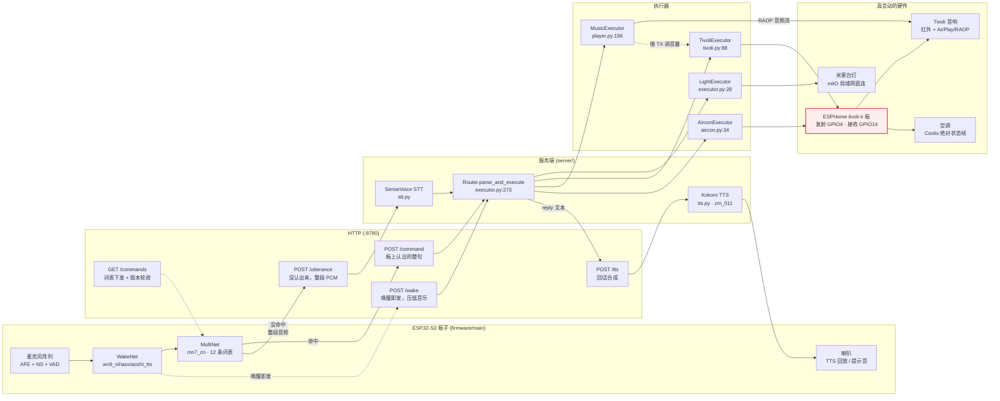
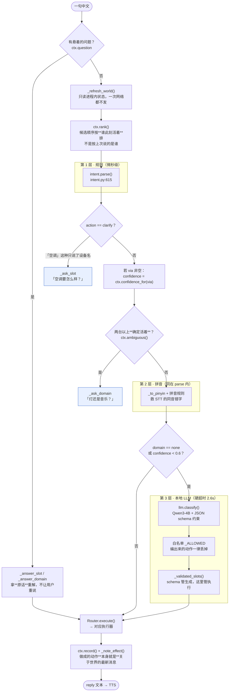
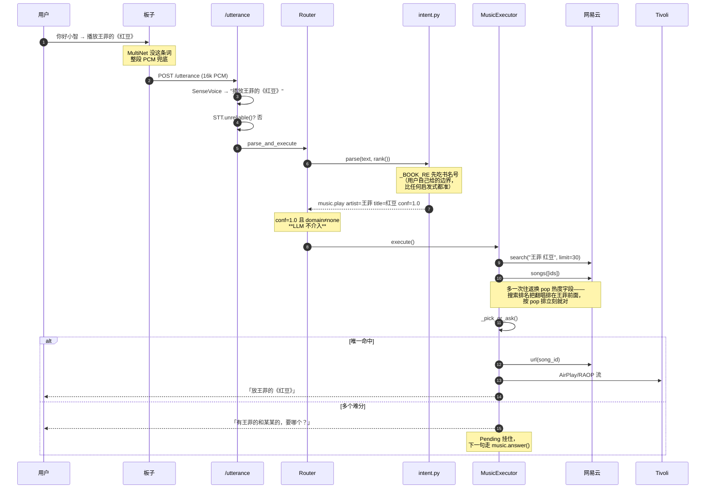
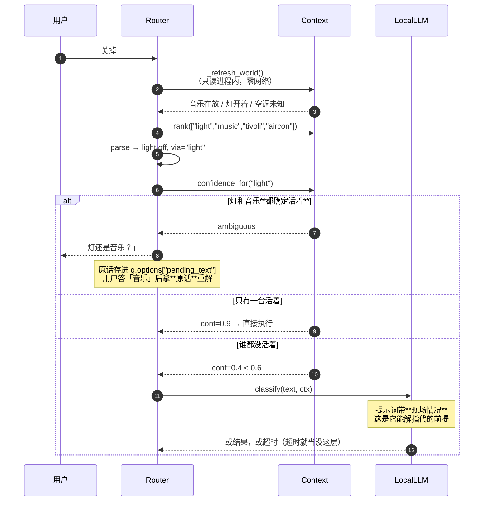
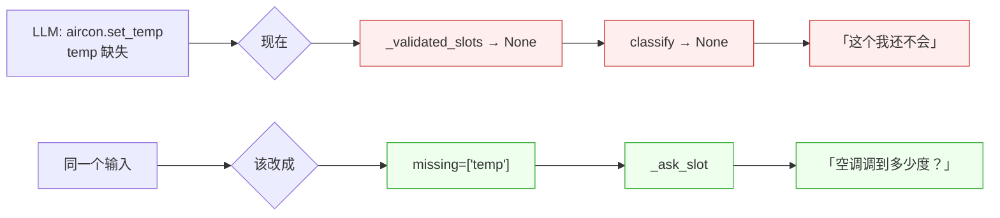
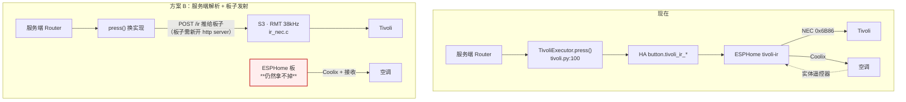
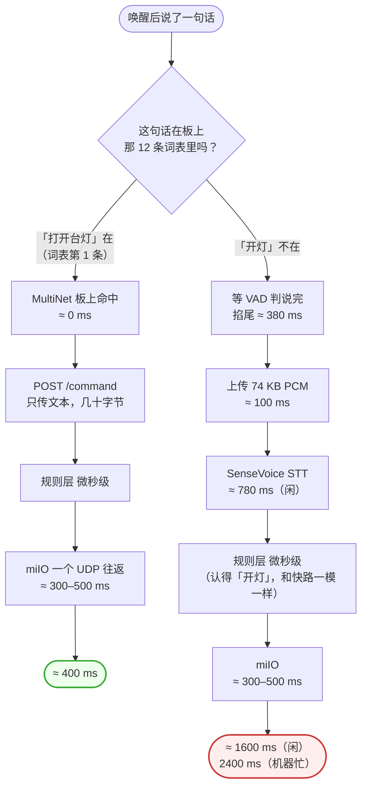

# S31 Voice 架构

> 配套 `README.md`。README 记的是**怎么走到这一步的**（踩过的坑、推翻过的结论），
> 这份记的是**现在长什么样**。两边冲突时以代码为准，然后来改这里。
>
> 最后核对：2026-09-16，对着 `server/*.py` 和 `firmware/main/*.c` 逐条验证过。
> §4 的三个缺陷已于同日修复，§6 的延迟账是实测的。

---

## 0. 一句话

> **LLM 不是意图层的入口，是它的兜底。**
> 设备判断（台灯 / Tivoli / 空调 / 音乐）在句子里有明确设备词时由规则层用微秒级正则完成，
> 置信度 1.0；只有句子**含糊**（「关掉」「大一点」）或**完全没命中**时，才轮到本地 LLM。

这不是省事，是刻意的——理由见 §3.4。

---

## 1. 全链路



**红框那块**是目前的结构性依赖：ESPHome 那块板同时是 Tivoli 的红外发射器**和**空调的
Coolix climate 实体（带接收机，好让有人用实体遥控器时 HA 跟得上）。
M21 想做的"单主控"因此不成立——见 §5。

---

## 2. 意图三层



### 2.1 置信度是"结论怎么来的"，不是概率

| 分值 | 含义 | 例子 |
|---|---|---|
| 1.0 | 句子里有明确设备词 | 「打开**台灯**」「把**空调**调到26度」 |
| 0.9 | 泛化词，但只有一台设备确实活着 | 放歌时说「大一点」 |
| 0.7 | 泛化词，靠"上一句聊的是它" | 话题是真信号，但比世界弱 |
| 0.6 | LLM 给的 | — |
| 0.4 | 泛化词，谁都没活着，纯兜底默认 | 开机就说「大一点」 |

`_ASK_LLM_BELOW = 0.6`（`executor.py:188`）——0.4 那一档会去问 LLM，0.7 不会。

---

## 3. 设备判断：实测四个域都对

`./.venv/bin/python -c "import intent; ..."` 的实际输出（2026-09-16）：

| 说的话 | domain.action | rule | via | slots |
|---|---|---|---|---|
| 打开台灯 | `light.on` | `on` | — | — |
| 播放王菲的《红豆》 | `music.play` | `music_play` | — | `artist=王菲 title=红豆` |
| 把空调调到26度 | `aircon.set_temp` | `ac_set_temp` | — | `temp=26` |
| 这首太吵了 | `tivoli.volume_step` | `volume_down` | — | `step=-3` |
| 把收音机声音关小 | `tivoli.volume_step` | `volume_down` | — | `step=-3` |
| 放点适合睡觉的歌 | `music.play` | `music_play` | — | `vibe=True` |
| 关掉 | `light.off` | `amb_off` | `light` | 含糊 → 降置信 |
| 大一点 | `light.brightness_step` | `amb_higher` | `light` | 含糊 → 降置信 |
| 空调 | `none.clarify` | `bare_device` | — | `device=空调` → 反问 |

**四个域在有设备词时全部 conf=1.0，LLM 一次都没被调用。** 这正是设计意图。

### 3.1 复杂点歌：「播放王菲的《红豆》」



**关键点：这条路 LLM 根本没上场。** 规则层抽槽 + 曲库裁决比 LLM 强——
LLM 不知道网易云上「红豆」有几十个翻唱版本，而 `pop` 字段知道。
`_resolve()` 里还有一条"整句本身就是歌名"的裁决（`player.py:580`），
专治「月亮代表我的心」被"的"劈成 歌手=月亮代表我 / 歌名=心。

### 3.2 含糊句：「关掉」



---

## 4. 三个缺陷（2026-09-16 已修）

这三条都会让系统**把指令发到错的设备上**或者**该发不发**。
回归在 `server/test_control_safety.py`（22 条）。

### 4.1 `_ACTION_HOME` 的跨设备修复是无条件的

`llm.py:145` 按"动作唯一属于哪个域"把 LLM 说错的域修回来。实测映射：

```
brightness_step → light      volume_step → tivoli      temp_step → aircon
```

修复本身是对的（「把收音机声音关小」LLM 答 `music.volume_step`，修成 tivoli 正确），
但它**不看原话**。如果 LLM 对着「这首太吵了」吐出 `music.brightness_step`，
`_ACTION_HOME` 会把它改成 `light.brightness_step` —— **去调台灯亮度**。
句子里的 domain 信号（「这首」= 音乐）是强的，幻觉出来的是 action，
而代码选择了相信 action。

> 现在这句被规则层以 conf=1.0 接住了（见 §3 表），所以暂时走不到这条路。
> 但这是巧合，不是防护。

**已修**：修复前先看原话**佐证**了哪个域。
判据是"它说的域被佐证了，而要修去的那个域没有" —— 这时候错的是动作，丢掉。

后半个条件是拿反例逼出来的：只判"原域被佐证就丢"会误伤
「这首歌音量小一点」（music 被"歌"佐证，但 tivoli 也被"音量"佐证，
而 volume_step 确实只有 tivoli 有）。两边都被提到时，动作才是分得开的信号。

### 4.2 合法但凭空来的数值

最初以为只是 `light.on` 的可选槽。**拿真模型一跑，面大得多**——
2026-09-16 qwen3:4b 实测，十句里七句带着 `"pct":0,"kelvin":0,"temp":0` 这样的填充值，
而其中一条是会出事的：

```
「太亮了受不了」 -> light.brightness pct=0     ← 必填槽，不是可选槽
```

`0` 落在 `[0,100]` 之内，范围检查一个字都挑不出来，灯被设成最低亮度——
一个用户从没说过的**绝对值**。编的动作有白名单挡着，编的数值长得和真数值一模一样。

**已修**：`_SLOT_EVIDENCE` 对 `pct/kelvin/temp/preset` 四个绝对值槽位要求原话依据，
必填可选一视同仁。没依据时：可选槽丢槽位保动作（「开灯」本身是对的），
必填槽转成"缺参"走 §4.3 的反问。

> 刻意不收裸中文数词：「调暗一点」「开一下」里的"一"会让任何填充值都过关。

### 4.3 缺参数时丢弃结果，而不是反问

```
_validated_slots({}, 'aircon', 'set_temp')  ->  None
_validated_slots({}, 'music',  'play')      ->  None
```

`None` 一路传回 `classify()` → `classify` 返回 `None` → `parsed` 保持规则层的
`domain=none` → `execute()` 回 **「这个我还不会」**（`executor.py:454`）。

但我们**明明知道**用户在说空调、在说要设温度，只是不知道设到几度。
`_ask_slot()` 那套机制就在旁边（`executor.py:376`），却没被接上。
这跟 `_ask_slot` 自己的注释是同一个毛病——那条注释写的是：

> 以前这里回的是"这个我还不会"，而那句话是**假的**：我们明明知道他在说空调。

**已修**：`_validated_slots()` 改成返回 `(槽位, 缺的键)`，三种结果分开：

| 返回 | 含义 | 该做的事 |
|---|---|---|
| `({...}, "")` | 拿到了 | 执行 |
| `(None, "temp")` | 该给的没给 | **问回去** |
| `(None, "")` | 给了但不合法 | 丢掉（幻觉信号） |

三道关的**顺序有讲究**，排错了会把"乱编"也变成"问回去"：
没给→问、类型/范围→丢、原话依据→问。（第一版就排错了，`pct=101` 被问成了"亮度调到多少？"）

Router 那边新增 `_ask_param` / `_answer_param`。不能复用 `_answer_slot`：
那条路是把域顶到最前面**重解整句**，而这里用户补的是一个**裸值**——
实测 `parse("26度")` 解不出任何意图（要「调到26度」才行）。

`step` 刻意不可问：「调高还是调低」本身就是这条指令的全部内容，
给不出方向说明模型压根没听懂，那是该丢的。问"要调亮还是调暗？"
只是把一次失败包装成一次对话。



---

## 5. 红外：M21 的前提已经不成立



| | 现在 | 方案 B | M21 原本想要的 |
|---|---|---|---|
| Tivoli 红外 | ESPHome 板 | S3 板 | S3 板 |
| 空调 Coolix + 接收 | ESPHome 板 | **ESPHome 板** | — |
| 能不能砍掉第二块板 | — | **不能** | 能（前提错了） |
| 断网可用 | 否 | 否 | 是 |
| 物理约束 | 麦克风和发射器可分开放 | **S3 必须同时听得见人、照得到 Tivoli** | 同左 |

板端本地识别（`CONFIG_S31_LOCAL_IR_ENABLED`）实测两对候选词都是 **0/6**，
而对照组「打开台灯/关闭台灯」在同一条路径上 **6/6**——是词的问题不是路径的问题，
原因未查明。详见 `README.md` §4.1.26。

**结论：M21 暂停。** 真要往下做，第一件事是拿到 J2 的原理图确定 TX 驱动电路和 GPIO——
那是唯一的硬阻塞，换方案不会让它自己好。

### 验收有个现成的见证人

ESPHome 板的 `remote_receiver`（GPIO14，`dump: all`）能解 NEC。
让 S3 发、它收，比对 address / command / ditto 数量。
这是这条**开环**链路上难得能拿到客观证据的机会——
比"听着好像大声了"可靠得多。

---

## 6. 延迟：为什么「打开台灯」快、「开灯」慢

用户观察到的现象是真的，但它**不是延迟问题，是路由问题**。
两句话走的是完全不同的两条路。



**两条路的意图层和执行层是同一段代码**，一毫秒都不差。
差的全在"板子怎么知道你说了什么"。

### 6.1 哪些是不可压缩的（2026-09-16 实测）

板子要知道你说了什么，物理上只有两条路：**本地有这个词**，或者**把音频送出去**。
后者的每一段都有硬下限：

| 环节 | 实测 | 为什么压不下去 |
|---|---|---|
| 等说完 | 380 ms | 音频不能在它存在之前被送走。M18 的教训正是端点检测切太早会**把句子切断**（「空调调低一点」不响应的根因），往回调是拿正确性换延迟 |
| 上传 74 KB | 100 ms | 边录边传最多省掉这 100 ms |
| SenseVoice | **780 ms** | 见下 |
| miIO 控灯 | 300–500 ms | 两条路都付，不是差异来源 |

SenseVoice 的成本结构很反直觉。拿不同长度的真语音量了一遍：

| 音频长度 | STT 耗时 | rtf |
|---|---|---|
| 0.95s「开灯」 | 748 ms | 0.79 |
| 1.80s「打开台灯」 | 780 ms | 0.43 |
| 2.48s「播放王菲的红豆」 | 806 ms | 0.32 |
| 2.88s「空调调到二十六度」 | 827 ms | 0.29 |

线性拟合：**固定 ≈ 724 ms + 每秒音频 ≈ 22 ms**。

> 也就是说 SenseVoice 几乎**与句子长短无关**。
> "说短一点会不会快些" —— 不会。rtf 这个指标在这里是误导的：
> 它随音频变长而变好，只是因为分母变大了。

也测了几个常见猜想，都不成立：

- **闲置惩罚**：没有。闲 5/15/30 秒后首次调用 699–754 ms，和连续调用一样。
- **噪声代价**：没有。SNR 0 dB 时 789 ms（听成「他有证」，识别错了但不慢）。
- **静音补白**：没有。前后各补 1 秒静音只多 20 ms。

→ **兜底路径的地板 ≈ 380 + 100 + 780 + 300 ≈ 1.56 s。**
把网络和上传优化到 0 也回不到 400 ms。唯一能让「开灯」变快的办法，
是让它**不走这条路**。

### 6.2 板子日志里那个 1635 ms

```
耗时 2376 ms = 上传 100(74.6KB) + 服务端 2162[STT 1635 控灯 527] + 网络 114
```

1635 ms 是基线的两倍，值得单独解释一下，否则会照着一个错的数字去优化：

- **LLM 争抢**：实测 qwen3:4b 同时在生成时，STT 从 804 → 1099 ms（+295 ms，1.4×）。
  但这条日志对应的是「放大音量」，规则层 conf=1.0 直接命中，**LLM 根本没被调用**。
- **真正的原因**：那一条是在回归测试里抓的，而测试脚本自己正在合成并播放音频。
  争抢的是测试台，不是生产负载。

> 记下来免得下次照着 1635 优化：日常的数字是 ~800 ms。

### 6.3 能做的事，按杠杆排序

**1. 把高频短词换进词表**（400 ms vs 1600 ms，6×）

12 条里 5 条是模式词（全亮/黄光/冷光/阅读/夜灯），2 条是长形式（打开台灯/关闭台灯）——
**词表被花在长尾说法上，而最高频最短的那两句掉进了兜底**。

但 §4.1.18 的零和约束是硬的（23 条时 2/7），所以只能**替换不能追加**。
而且有个具体风险：`开灯 kai deng` 和 `打开台灯 da kai tai deng` 后三个音高度重叠，
正是 §4.1.18 说的"前两个音节要分得开"会踩的坑 —— 两条可能互相稀释。
必须跑 `tools/mn_regress.sh`，而且要**同时验新词和被它影响的老词**。

**2. 让 STT 不和别人抢 CPU**（省 ~300 ms，且对所有兜底命令生效）

这一条没有零和代价。qwen3:4b 常驻 3 GB、`keep_alive 15m`，
而规则层覆盖九成、LLM 很少真被调用。可以缩短 keep_alive，
或给 STT 那次调用限定线程数 / 让它和 Ollama 错开核。

**3. 边录边传**（省 ~100 ms）—— 杠杆最小，复杂度不低，不该先做。

**不该做的：缩短 VAD 尾判。** M18 已经踩过：切太早会把句子切断。

### 6.4 词表替换实验，以及它挖出来的测试台缺陷（2026-09-16）

想把高频短词「开灯 / 关灯」换进板上词表。用 `MULTINET_TABLE="开灯,关灯"` 让服务端
发一张两条词的表（板子每 60s 轮询 `/commands/version`，**不用烧固件**），
带一条判别词「打开台灯」——它不在表里，如果还能被认出来就说明旧表没换掉。

跑了两轮，第二轮换了激励源：

| 激励源 | 开灯 | 关灯 | 判别词「打开台灯」 |
|---|---|---|---|
| Kokoro（项目一直在用的） | 2/3，prob 0.16–0.18 | 3/3，0.19–0.50 | 0/3 未触发 |
| macOS `say -v Tingting` | **3/3，0.17–0.46** | **3/3，0.40–0.65** | 3/3 全部**听成「开灯」** |

换激励源之后置信度从 0.16 跳到 0.46。差别不在板子，在**送进去的声音本身**。

#### 用户听出来的：合成音的声调是错的

用户听着回归在放音，说了两次：「开1灯1，你说成了开4灯4」、「又是灯1kai4了」。
量基频（一声应为平调，四声为高降）：

| 合成方式 | 开 | 灯 | 应有 |
|---|---|---|---|
| Kokoro 孤立「开灯」 | −5.5 | **−10.1** | ≈0 ≈0 |
| Tingting 孤立「开灯」 | **−5.3** | +0.0 | ≈0 ≈0 |
| Kokoro 载体句「开灯以后再说」 | −2.4 | −1.5 | ≈0 ≈0 |

单字对照验证了这把尺子本身：Kokoro 念「妈」(一声) 测出 −2.9、「骂」(四声) 第一段反而 **+3.4**，
完全反了；Tingting 是 +1.3 / −6.1，正确。

g2p **没错**（misaki 给的是 `ㄎㄞ1ㄉㄥ1`，两个一声）。错的是声学模型：
**两音节词太短，整个词都落在陈述句语调的斜坡上**，词汇声调被语调盖掉。
两个引擎都有这个毛病，只是位置不同 —— Kokoro 压末字，Tingting 压首字。
载体句能把失真从 −10.1 压到 −1.5，证明症结是"处于句尾"，不是模型不会念一声。

#### 波及面：一条写进词表注释的"规律"可能是它造出来的


| 历史被毙的词 | 音节 | 末字调 | 实测末字 | 当年结论 |
|---|---|---|---|---|
| 最亮 | 2 | 4 | −12.1 | 0/9 静默 |
| 最暗 | 2 | 4 | −10.4 | 0/9 静默 |
| 下一首歌 | 4 | 1 | −3.4 | 0/3 |
| 关掉收音机 | 5 | 1 | **+0.4** | 正式表最稳 0.45 |

被毙的全是短词，而短词正是激励最失真的地方。
§4.1.18 那条「每条至少 3 个音节」的规律，**有相当一部分可能是测试台的产物**。

> README §4.1.18 自己写过：「测试工具出错比被测物出错更危险，因为错的是
> **你用来判断对错的那把尺子**。」那一节抓出了三个这样的 bug。这是第四个，
> 而且它不是让某一轮结果错，是让**一条被写进注释、指导了后续所有选词的"规律"**错。
> 抓出它的不是日志，是有人在旁边听见了。和 §4.1.18 末尾那条一模一样：
> 开着麦克风的系统，日志里没有"房间里实际听起来怎么样"这一维。

#### 结论：实验暂停，先修尺子

两条词本身**不是静默失效那一类**，它们能用。但有两个障碍：

1. **尺子还是坏的。** 目前没有一个能正确念出两音节词的激励源。
   用已知失真的尺子去量"两条短词和长词的干扰"，量出来的数字不足以支撑
   "要不要牺牲两条模式词"这种决定。
2. **`kai deng` 会塌到 `da kai tai deng` 上。** 判别词三轮三次被听成「开灯」——
   这不是偶然。两条并存时「打开台灯」很可能被吃掉，而它是现在唯一稳定的开灯命令。

修尺子有三条路：载体句合成后按静音切出目标词（改动只在 `speak.sh`，实测能压到 −1.5）、
录真人音、或者接受失真只做相对比较。

#### 实验期间的副作用（记录在案）

实验跑的时候用户正在正常使用系统，说「打开台灯」得到的回复是「灯已关」。
原因：**MultiNet 不会说"我不认识"** —— 它总在已注册的词里挑最近的一条，
而当时板上只有 `{开灯, 关灯}`。`DRY_RUN=1` 挡住了真实执行，所以灯没动，但话说错了。

> 判别词被误匹配是**设计好的**，它正是用来证明旧表已经换掉。
> 没预料到的是有人会在实验窗口里正常用这套系统 —— 换表这类操作
> 会让设备在一段时间内**系统性地听错话**，开跑之前得先打招呼。


---

## 7. 这套设计为什么不让 LLM 当入口

| | 规则层 | 本地 LLM |
|---|---|---|
| 延迟 | 微秒 | 1.16–1.71s 典型，2.6s 硬超时 |
| 确定性 | 同一句话永远同一个结果 | 今天这么解，明天那么解 |
| 断网 | 照常 | 照常（本地跑），但吃 3G 内存 |
| 覆盖 | 家里的指令空间九成 | 剩下那一成 |
| 编设备 | 不可能 | 会——所以有 `_ALLOWED` 白名单 |

内存账（`llm.py` 开头记的）：
SenseVoice ≈1.2G + Kokoro ≈0.5G + Qwen3-4B ≈3G + HA 容器 ≈1G + 系统 ≈4G ≈ **10G / 16G**。
选 4B 不选 7B 是被内存逼的。

> 有一条经验值得单独记：曾经写过一版"拿不准就答 none"的提示词，实测**反了**——
> 模型明明听懂了（对「这首太吵了」它回的 reply 是"太吵了，调低点？"），
> 却照着提示词答 `domain=none`，五句里五句作废。
> 编造不存在的动作有白名单挡着，那才是真风险；
> **让一个答得对的模型闭嘴不是安全，只是失败。**

---

## 8. 不变的那条底线

> **没有回执的链路，不能把"命令发出去了"当成"事情做成了"。**

| 设备 | 有没有回执 | 后果 |
|---|---|---|
| 米家台灯 | 有（miIO 局域网直连） | `_note_effect()` 敢记世界状态 |
| 空调 | **有**（Coolix 是绝对状态帧，且 ESPHome 在收） | 敢记；连说「太热」「太冷」用自己的 `_last_set` 当基准 |
| Tivoli 红外 | **没有** | `press()` 返回 True 只代表发出去了；`power_off()` 永远不报成功 |
| AirPlay | 有（RAOP 链路状态） | 但**地址本身可能是错的**，见下 |

M20 就是在还这笔账：`reachable()` 失败只代表**不知道**，不代表设备关着。
详见 `README.md` §4.1.25。

### 同一笔账，`player.py` 里还欠着（2026-09-16 补上）

用户报「播放王菲的红豆」，系统答**「音响不在线，先打开它」**，而音响就在旁边开着。

查下来不是音响的问题，是**地址过期**，而且它伪装得很好：

| 地址 | ping | :7000 |
|---|---|---|
| `192.168.0.107`（`.env` 里写的） | ✅ 通 | ❌ ConnectionRefused |
| `192.168.0.108`（Tivoli 实际在的地方） | ✅ | ✅ 8 ms |
| `audiocast.local`（mDNS 名） | — | ✅ 27 ms |

DHCP 把 Tivoli 挪了一格，而旧地址上住进了别的设备 —— **ping 通、7000 拒绝**，
于是"地址过期了"被报成了"音响没开机"。mDNS 里 Tivoli 一直在正常广播
`_airplay._tcp`，这也正是用户在系统「声音」面板里看得见它的原因：
那个列表来自 Bonjour 发现，和我们写死的那个 IP 没有半点关系。

两处都改了：

1. `AIRPLAY_HOST` 改成 `audiocast.local` —— 不随租约漂。
   `discovery.py` 开头早就为板子写过同一段道理（"板子上写死 IP 是在用最贵的
   操作解决最廉价的问题"），只是 AirPlay 这头一直漏着。
2. `player.py:_ensure_link()` 那句回话不再断言。
   `reachable()` 失败只说明"在我被告知的那个地址上没找到它"。

> 骗人的不是探测，是那句把"不知道"说成"我知道"的回话。
